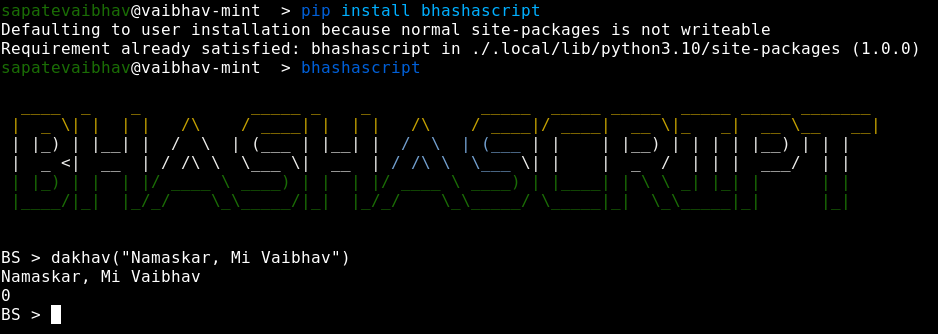
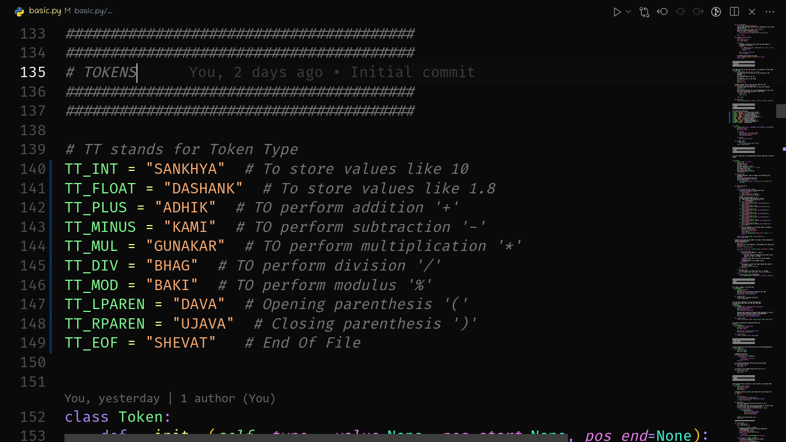

# BhashaScript
---
Finally the first release has been published on ``pypi.org``

### Getting Started

1. Installing the package
```bash
pip install bhashascript
```

2. Starting the BhashaScript console
```bash
bhashascript
```

3. Writing the very first line of code 
```bs 
dakhav("kay chal mag Bhava")
```
 .


A small effort to make simple Marathi programming language for fun built using python3.

I have attached some screenshots to make sure you get actual idea of what is going on here.

### Tokens
 .


