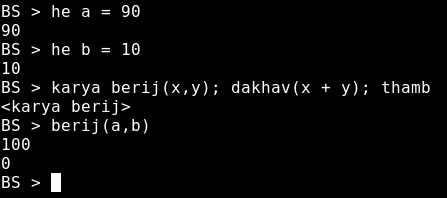

# BhashaScript
---
Finally the first release has been published on ``pypi.org``


A small effort to make simple Marathi programming language for fun built using python3.

---

### Getting Started

1. Installing the package
```bash
pip install bhashascript
```

2. Starting the BhashaScript console
```bash
bhashascript
```

3. Writing the very first line of code 
```python 
dakhav("kay chal mag Bhava")
```
 .

4. Variable declaration
```python
he a = 10 # Sankhya
he b = "Raje" # Shabda
he c = 1.1 # Dashank
```
image describing Variable declaration


5. If-Elif-Else
Here, if is described as ``jar`` elif as ``nahijar`` and else as ``nahitar``
```python
he a = 10
jar a == 9 tar; dakhav("Nau") nahijar a == 10 tar; dakhav("Daha") nahitar dakhav("chuk")
```

The image of what is going on is here


6. loop
loop what do you call them in marathi. Here is ``jowar`` representing ``while``
```python
jowar i < 10 tar; # condition for loop
he i = i + 1; # increase the i by 1
he j = j + i; # add i to j
thamb # end of loop
```


7. Break and Continue
Hmmm, When loops and conditional statements are there then ``break`` and ``continue`` must be there right.

```python
he i = 0
he j = 0

jowar i < 10 tar;
he i = i + 1;
jar i == 4 tar chal; # continue
he j = j + 1; # increase j by i
jar i == 8 tar tod; # break
thamb
```


8. Functions 

Are you interested in functions. Yes we do have them both inbuilt as well as user defined. The keyword used is ``karya`` for ``function``

-   User defined
```python
karya berij(x,y); # function to add 2 arguments
dakhav (x + y); # pring the result
thamb # end of function
berij(100, 200) # function call
```
here is simple implementation of user defined function for addition of two numbers


-   Inbuilt as mul karya


## Below two are the raw images of what is more in the language detailed description will be added shortly


<!-- 
I have attached some screenshots to make sure you get actual idea of what is going on here.
### Tokens
 . -->

